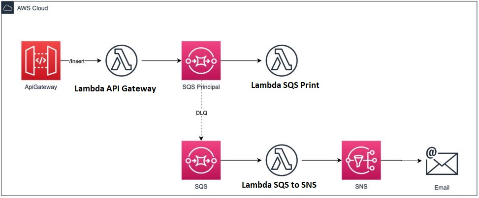

# Trabalho Final Cloud Computing & SRE

>  Documentação do Trabalho de Conclusão da Disciplina CLOUD COMPUTING & SRE  - Prof.: RAFAEL DE FREITAS BARBOSA

## Visão Geral do sistema:


## Itens criados com Terraform:
* SQS Principal
* SQS DLQ
* SNS Email para fila DLQ
 
## Serverless:
* TODO
* Lambda SNS para envio de email


# Passos para rodar a aplicação:

############### S3 ##################

* Realize o clone do seguinte repositório:
```sh
git clone https://github.com/BrunoSilva284/trabalho_terraform.git
```

* Navegar até a pasta do projeto terraform/S3 para iniciar o Bucket:
```sh
cd trabalho_terraform/terraform/S3
```
* Altere a propriedade ```bucket``` e ```Name ``` com um nome unico e salve o arquivo:
```sh
#Bucket para estado remoto
resource "aws_s3_bucket" "bucket" {
  bucket = "<nome-unico-bucket>"
  acl    = "private"

  tags = {
    Name        = "<nome-unico-bucket>"
    Environment = "admin"
  }
}
```
 
* inicie o S3  e guardar seu nome em uma variável
```sh
terraform init
terraform plan
terraform apply -auto-approve
cd ..
```
############### Terraforms ##################

* Iniciar as duas filas SQS e o SNS:

*Antes de iniciar, altere o arquivo /trabalho_terraform/terraform/state.tf altere a propriedade bucket com o nome unico do passo anterior.
```sh
terraform {
  backend "s3" {
    bucket = "<nome-unico-bucket>"
    key    = "trab-final"
    region = "us-east-1"
  }
}
```
*OBS*: O último comando cria um arquivo com os ARNs e URLs dos serviços criados para uso posterior.

```sh
terraform init
terraform workspace new prod
terraform workspace select prod
wks=$(terraform workspace show) 
terraform plan
terraform apply -auto-approve
terraform output -json > ../serverless/arns-${wks}.json
cd ..
```

############### ServLess ##################

(OBS a variavel $wks pode ser informada manualmente conforme o ambiente de trabalho)

* Iniciar as aplicações serverless - lambda-sqs-to-sns: 
```sh
cd serverless/lambda-sqs-to-sns
virtualenv ~/venv
source ~/venv/bin/activate
pip3 install -r requirements.txt -t layer
sls deploy --stage prod
sls invoke -l -f sqsHandler --stage prod
cd ..
```
* Iniciar as aplicações serverless - lambda-sqs-print:
```sh
cd lambda-sqs-print
pip3 install -r requirements.txt -t layer
sls deploy --stage prod
sls invoke -l -f sqsHandler --stage prod
cd ..
```

* Iniciar as aplicações serverless - api-gateway-terraform:
```sh
cd apigateway
pip3 install -r requirements.txt -t layer
sls deploy --stage prod
```
